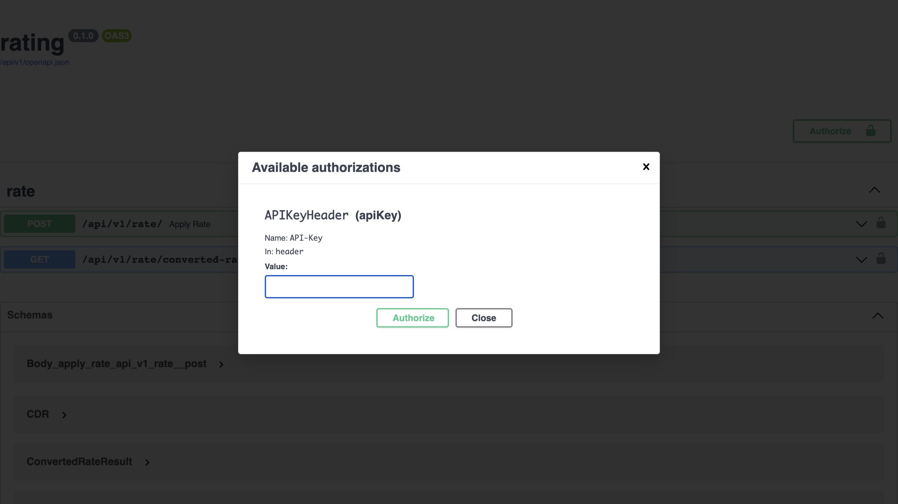
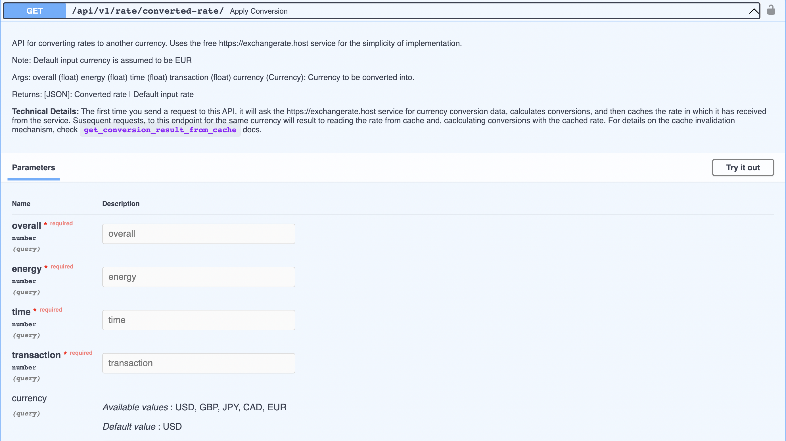
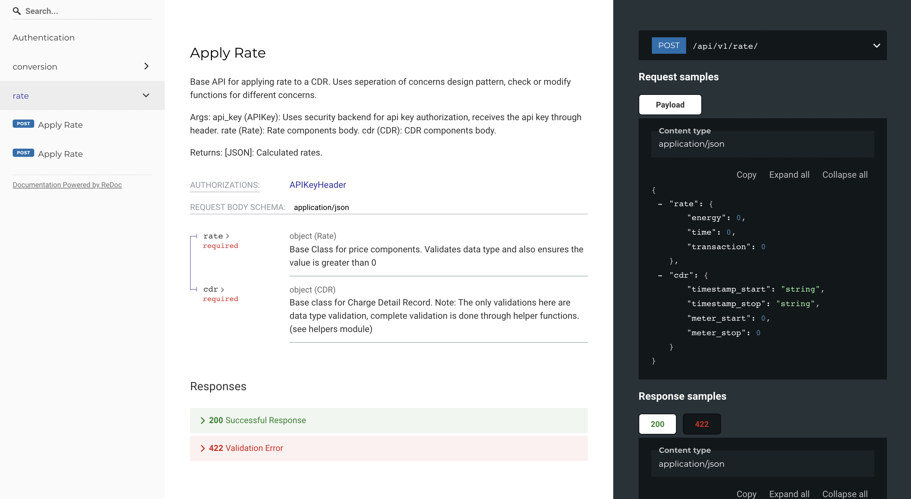
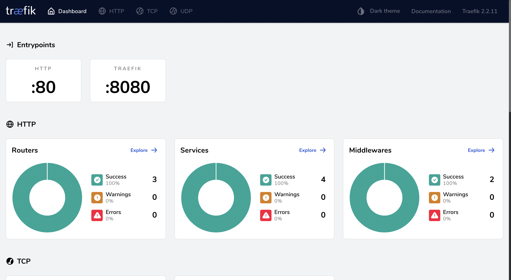
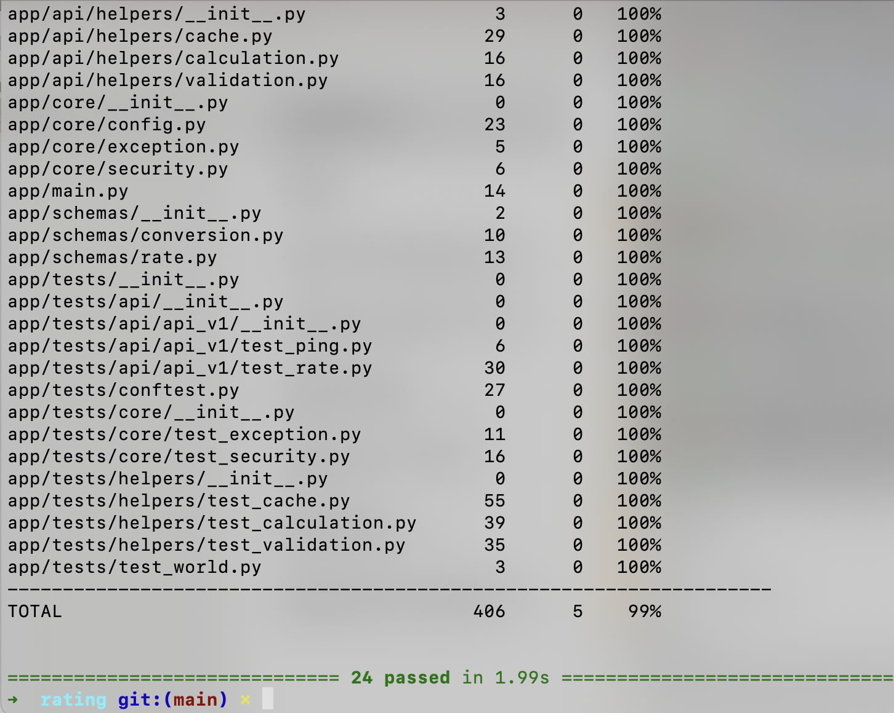

# rating

### [Notes for the reviewer](notes.md)

## Requirements

* [Docker](https://www.docker.com/).
* [Docker Compose](https://docs.docker.com/compose/install/).

## Backend local development

### The .env file

First, create a `.env` file and put it inside the root folder of the project.  
The `.env` file is the one that contains all your configurations, api keys, etc.
You can copy/paste the contents from `.env.example` to your `.env` file.

### Security

The endpoints in this project use API key as a method of authorization for the requests they response.
You would need to create a secret API key and put it inside the `.env` file for the APIs to work properly.


You can create secret keys with the below command:

```bash
openssl rand -hex 32
# Outputs something like: 99d3b1f01aa639e4a76f4fc281fc834747a543720ba4c8a8648ba755aef9be7f
```

Assign the generated secret to `API_KEY_SECRET` inside the `.env` file.

```bash
API_KEY_SECRET=your-generated-secret
```

Now all you have to do is Authorize yourself when you go to the `http://localhost/docs` (with your-generated-secret)



### Security Technical Details

The enpoints inside this project use Dependency Injection to receive the API key inside the Headers upon request. `API-Key`. Note that `X-` prefix is [deprecated since 2012](https://datatracker.ietf.org/doc/html/rfc6648)

### Running
* Start the stack with Docker Compose:

```bash
docker-compose up -d
```
**Note**: You may get a warning like the one below, which you shouldn't be alarmed about.

```bash
The following deploy sub-keys are not supported and have been ignored: labels
```
If you are curious you can [check this](https://github.com/docker/compose/issues/6539#issuecomment-581010139) for more details.

* Now you can open your browser and interact with these URLs:

Backend, JSON based web API based on OpenAPI

Automatic interactive documentation with Swagger UI (from the OpenAPI backend): http://localhost/docs



Alternative automatic documentation with ReDoc (from the OpenAPI backend): http://localhost/redoc



Traefik UI, to see how the routes are being handled by the proxy: http://localhost:8090



**Note**: The first time you start your stack, it might take a few minutes for it to be ready. While the backend configures everything. You can check the logs to monitor it.

To check the logs, run:

```bash
docker-compose logs
```

## Backend local development, additional details

### General workflow

Modify or add Pydantic schemas in `./backend/app/app/schemas/`, API endpoints in `./backend/app/app/api/`, API helpers or utils in `./backend/app/app/api/helpers`. 

### Docker Compose Override

During development, you can change Docker Compose settings that will only affect the local development environment, in the file `docker-compose.override.yml`.

The changes to that file only affect the local development environment, not the production environment. So, you can add "temporary" changes that help the development workflow.

### Backend tests

To test the backend run:

```console
$ DOMAIN=backend sh ./scripts/test.sh
```

The file `./scripts/test.sh` has the commands to generate a testing `docker-stack.yml` file, start the stack and test it.

To run the tests in a running stack:

```bash
docker-compose exec backend bash /app/tests-start.sh
```


The tests run with Pytest, modify and add tests to `./backend/app/app/tests/`.

### Backend tests, additional details

If you need to pass extra arguments to `pytest`, you can pass them to this command and they will be forwarded.
For example, to stop on first error:

```bash
docker-compose exec backend bash /app/tests-start.sh -x
```

#### Test Coverage

Because the test scripts forward arguments to `pytest`, you can enable test coverage HTML report generation by passing `--cov-report=html`.

To run the local tests with coverage HTML reports:

```Bash
DOMAIN=backend sh ./scripts/test-local.sh --cov-report=html
```

To run the tests in a running stack with coverage HTML reports:

```bash
docker-compose exec backend bash /app/tests-start.sh --cov-report=html
```
If you use GitLab CI the tests will automatically run.

## Deployment

You can deploy the stack to a Docker Swarm mode cluster with a main Traefik proxy, set up using the ideas from <a href="https://dockerswarm.rocks" target="_blank">DockerSwarm.rocks</a>, to get automatic HTTPS certificates, etc.

And you can use CI (continuous integration) systems to do it automatically.

But you have to configure a couple of things first.

### Traefik network

This stack expects the public Traefik network to be named `traefik-public`, just as in the tutorials in <a href="https://dockerswarm.rocks" class="external-link" target="_blank">DockerSwarm.rocks</a>.

If you need to use a different Traefik public network name, update it in the `docker-compose.yml` files, in the section:

```YAML
networks:
  traefik-public:
    external: true
```

Change `traefik-public` to the name of the used Traefik network. And then update it in the file `.env`:

```bash
TRAEFIK_PUBLIC_NETWORK=traefik-public
```

**Note**: The `${STACK_NAME?Variable not set}` means "use the environment variable `STACK_NAME`, but if it is not set, show an error `Variable not set`".

### Deploy to a Docker Swarm mode cluster

There are 3 steps:

1. **Build** your app images
2. Optionally, **push** your custom images to a Docker Registry
3. **Deploy** your stack

---

Here are the steps in detail:

1. **Build your app images**

* Set these environment variables, right before the next command:
  * `TAG=prod`
* Use the provided `scripts/build.sh` file with those environment variables:

```bash
TAG=prod bash ./scripts/build.sh
```

2. **Optionally, push your images to a Docker Registry**

**Note**: if the deployment Docker Swarm mode "cluster" has more than one server, you will have to push the images to a registry or build the images in each server, so that when each of the servers in your cluster tries to start the containers it can get the Docker images for them, pulling them from a Docker Registry or because it has them already built locally.

If you are using a registry and pushing your images, you can omit running the previous script and instead using this one, in a single shot.

* Set these environment variables:
  * `TAG=prod`
* Use the provided `scripts/build-push.sh` file with those environment variables:

```bash
TAG=prod bash ./scripts/build-push.sh
```

3. **Deploy your stack**

* Set these environment variables:
  * `DOMAIN=rating.com`
  * `TRAEFIK_TAG=rating.com`
  * `STACK_NAME=rating-com`
  * `TAG=prod`
* Use the provided `scripts/deploy.sh` file with those environment variables:

```bash
DOMAIN=rating.com \
TRAEFIK_TAG=rating.com \
STACK_NAME=rating-com \
TAG=prod \
bash ./scripts/deploy.sh
```

---

### Continuous Integration / Continuous Delivery

If you use GitLab CI, the included `.gitlab-ci.yml` can automatically deploy it. You may need to update it according to your GitLab configurations.

GitLab CI is configured assuming 2 environments following GitLab flow:

* `prod` (production) from the `production` branch.
* `stage` (staging) from the `master` branch.
